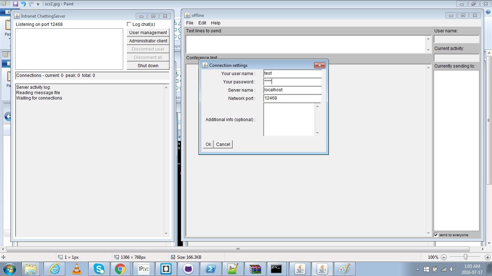
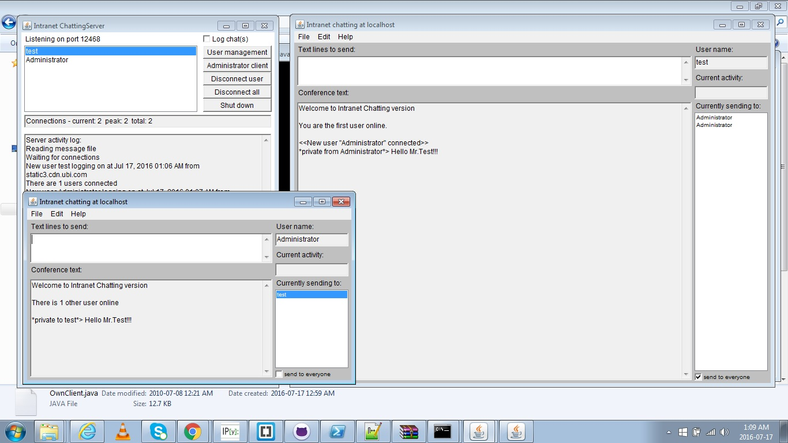

# IntranetChatting

This is a desktop based chatting tool using Socket programming for communicating over the network.Front end is designed using JAVA Swing API.
It has two important modules
## Admin Module 
Admin module listens for client connections and accepts the requests using password authentication. It has the User Management functionality where an admin user can create, modify or delete users.
An admin user can view all the users who are online and has the access to remove/disconnect any user from the network.
The admin module also has an Administrator Client window which is nothing but a client module used for communication.

##Client Module
It is the module which runs on all the client machines using which the users can connect to the network using theie credentials andd communicate with each other by sending private messages. Combination of server IP and port are used for communication.
There is also the option to broadcast messages to all the users(called conferenc text)

##Screen Shots
For the sake of convenience both admin and client module were run on the same machine in the screen shots below

* 1 Basic front end view of both admin(left hand side) and client(right hand side) modules.

* 2 Adminstrator can create users by assigning username and password.

* 3 Users can connect to the server using the usernames and passwords provided by the administrator and will be able to communicate with other clients and also the administrator over the network.

* 4 The administrator will be able to track all the users who have connected to the network or disconnected from the network. He/she also has the auhtority to disconnect a user if and when needed. The administrator also has a "log chats" option to save and monitor all the chats over the network.

* 5 The administrator can also launch an Admin Client to send/receive messages from other clients. This Admin Clients works in the same way as any other client and will be opened in a separate window.

* 6 The client can see the list of users who are currently available on the network and send private messages to anyone of them. These messaged can be seen in the "Conference Text" part of the window.

